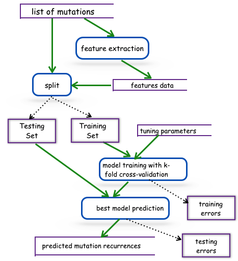

# Noncoding Mutation Recurrence Prediction

This project is about exploration of regression models for noncoding mutation recurrence in cancer, aiming at finding a most accurate regression model for noncoding mutation recurrence prediction so that based on the predicted recurrences, we can rank the noncoding mutations by their recurrences from high to low, and then choose the top N mutations as cancer driver mutation candidates and then identify through biological experiment validations. 

<b>Author:</b> Tanjin Xu, tjx711@gmail.com  
<b>Respondent:</b> Dr. Stephen A. Ramsey, stephen.ramsey@oregonstate.edu  
<b>Org:</b> Dr. Ramsey Lab, Oregon State University, http://lab.saramsey.org/

 
<b>Mainly it includes three steps in the whole procedure:</b>
<ol>
<li> Noncoding mutation annotation, feature extraction, and recurrence calculation </li>
<li> Regression analysis with three main categories of nonlinear models: 
   <ul>
     <li> Generalized linear model including Poisson and Negative Binomial (written in R) </li>
     <li> Ensemble of decision trees including Random Forest and Boosting (written in Python)</li>
     <li> Deep neural network (written in Python)</li>
   </ul>
</li>
<li> Result analysis and plotting </li>
</ol>

<b>Code examples explanation:</b> 
<ul>
<li> <a href="https://github.com/tj711/noncoding-recurrence/blob/master/source/noncoding_extract_features.py"> noncoding_extract_features.py </a> : the main entry to extract features.  </li>
<li> <a href="https://github.com/tj711/noncoding-recurrence/blob/master/source/run_features.sh"> run_features.sh </a> : the bash script to call feature extracting with different inputs of raw features in BED format. </li>
</ul>

